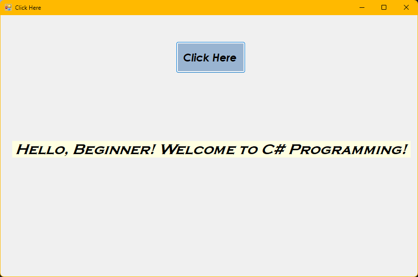

# 🖥️ C# WinForms Starter — Beginner-Friendly Template

<p align="center">
  <a href="https://github.com/Achintha-999/CSharp-WinForms-Starter">
    
  </a>
  
  
  
  <a href="LICENSE"></a>
  
</p>

<p align="center">
  <em>A tasteful, simple starter WinForms app with decorative README — icons, badges, and helpful hints to get you coding quickly.</em>
</p>

---


<div align="center">
  <kbd style="background:#f6f8fa;padding:6px;border-radius:6px;border:1px solid #e1e4e8;">
    <strong>What's inside:</strong> minimal UI • button click event • label update • easy to extend
  </kbd>
</div>

---

Table of contents
- [About](#about) ✨
- [Showcase](#showcase) 🖼️
- [Features](#features) ⚡
- [Tech Stack](#tech-stack) 🧰
- [Project structure](#project-structure) 📁
- [Quick start](#quick-start) ▶️
- [Usage example](#usage-example) 🧩
- [Contributing](#contributing) 🤝
- [License](#license) 📜
- [Acknowledgements](#acknowledgements) ❤️
- [Contact](#contact) 📬

---

## About ✨
This repository is designed for beginners learning C# and Windows Forms (WinForms). It demonstrates a very small, focused example: wiring a button click to update a label. The code is intentionally simple so you can copy, modify, and learn.

---

## Showcase 🖼️

<p align="center">
  
</p>


---

## Features ⚡
- 🧭 Beginner-friendly structure and comments
- 🔘 Button click → label update (event handling)
- 🖼️ Simple, extendable WinForms UI
- 🧩 Clear separation of Designer vs Logic files

---

## Tech Stack 🧰
- C# 7.3
- .NET Framework 4.7.2
- Windows Forms (WinForms)
- Visual Studio (recommended)

---

## Project structure 📁
A compact view of the typical layout — update if your repo differs:

```
WindowsFormsApp1/
├── WindowsFormsApp1.sln         # Visual Studio solution (if present)
├── WindowsFormsApp1/
│   ├── Form1.cs                 # Main form logic
│   ├── Form1.Designer.cs        # Designer-generated UI code
│   ├── Program.cs               # App entry point
│   └── Properties/
│       ├── AssemblyInfo.cs
│       └── Resources.resx
├── image1.png                    # App screenshot used in README
└── LICENSE
```

---

## Quick start ▶️
1. Clone the repository:
   ```bash
   git clone https://github.com/Achintha-999/CSharp-WinForms-Starter.git
   ```
2. Open the solution in Visual Studio (2017/2019/2022).
3. Restore packages if prompted.
4. Build (Build → Build Solution) and run (F5).

---

## Usage example 🧩
Open Form1.cs and inspect the event handler:

```csharp
private void btnClickMe_Click(object sender, EventArgs e)
{
    lblMessage.Text = "Hello, WinForms! ✨";
    // Add additional logic here
}
```

Tips:
- Use the Designer to add controls quickly.
- Name your controls with clear prefixes (btn, lbl, txt).

---

## Contributing 🤝
Love it? Want to improve the README or add more examples?
- Open an issue to discuss changes.
- Submit a PR with a clear description and small, focused commits.
- Keep code style consistent and add comments.

Contributors are welcome — please follow a friendly, helpful tone when reviewing.

---

## License 📜
This project is licensed under the MIT License — see the [LICENSE](LICENSE) file for details.

---

## Acknowledgements ❤️
- Thanks to the .NET community for guides and examples.
- Inspired by minimal educational templates and developer-friendly docs.

---

## Contact 📬
Created by Achintha-999. Open an issue for questions or suggestions.

---

Made with ❤️ and a little polish — icons, badges, and a clean layout to help beginners feel comfortable. Happy coding! 🚀


